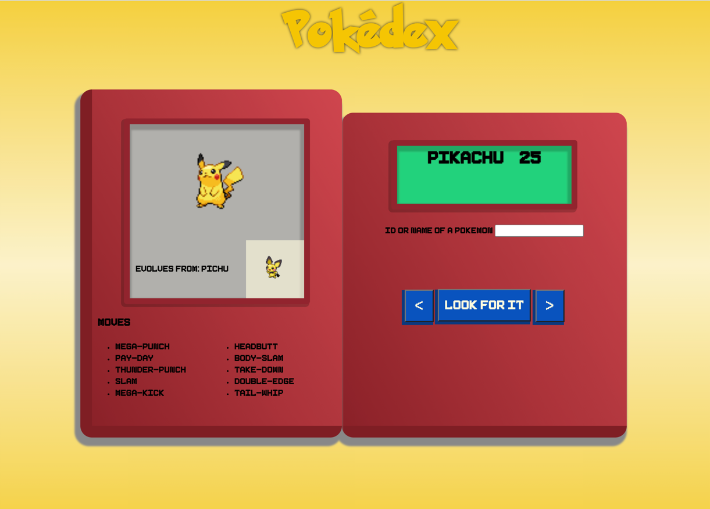

# pokedex PHP version

### creating a pokedex in this case with php, same goals different language

---

*At first, I will try to preserve the same html, and css that i used with JS, that would save a lot of time.* - it was a bit naive...

### my goals:

- [x] json object, is successfully accessed 
  
##### display:
- [x] name and id
- [x] picture
- [x] evolution
- [x] moves
  

- [x] appearance

---

before extras:

### extras:

- [x] next previous button (previous evolution also clickable)
- [x] gradient background depending on the pokemon types
- [ ] extra info for each item on the page
- [ ] encounters *(extra spicy)*

---

after extras:

previous project: https://github.com/izidormaklary/pokedex-js-project